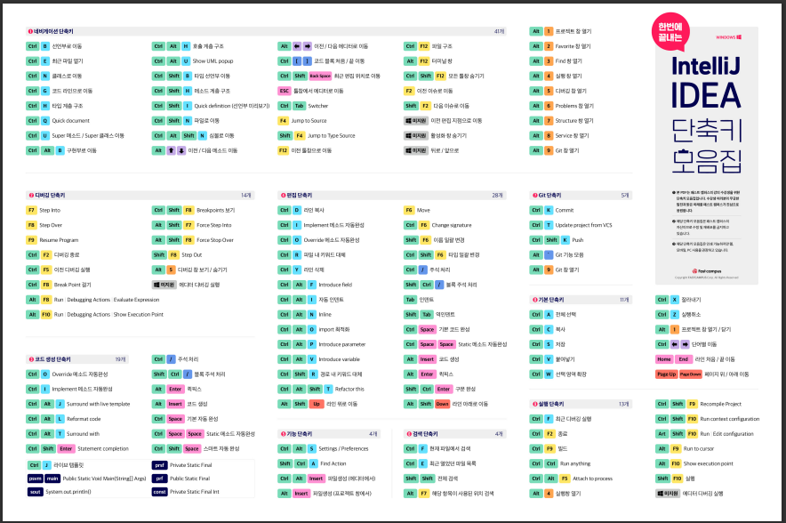

# \[부록] IntelliJ 가이드


\[부록] IntelliJ 가이드 (구글 문서 링크)


## Ch 01. 인텔리제이 시작하기

인텔리제이 설치하기 \[ Community 버전 ]

## Ch 02. 인텔리제이 단축키

\*PDF 파일 참고

### \[ 단축키 기본 I ]

### \[ 단축키 기본 II ]

### \[ 단축키 응용 ]

## Ch 03. 인텔리제이 실습 -To do List 구현

### 01. 요구사항 정리



&#x20;**- \[기능명세] Todo List api 서버 개발 기능 구현**

&#x20;**- \[API 스펙]: 기능들을 어떤 api로 구현할 것인지 정의 (** [**패캠\_자바\_IntelliJ\_실습**](https://docs.google.com/spreadsheets/u/0/d/1KQbqeMOU0VjEr5DQzD7coKMtEuEkHgrxLYaQTEQ9t9o/edit)**\_엑셀파일 참고)**

### **02.** 환경설정 및 프로젝트 세팅 (spring boot)

* 프로젝트 생성 (build system으로 gradle 선택)
* ‘build.gradle’ 파일 선택 (오른쪽 상단에 gradle. 없으면 View → Tool Window → Gradle)
* 현재 있는 dependencies 삭제하고 + 리로드( ↺ )
* 우리가 필요한 plugins과 dependencies로 채워준다. (라이브러리 참고 사이트)

&#x20;i) plugins에 spring boot 추가&#x20;

ii) dependencies에 필요한 의존성 라이브러리들 추가&#x20;

iii) lombok도 dependencies에 추가 → 바로 사용 X → lombok 플러그인 설치 ( shift 두 번 → lombok 검색 → 설치 → 인텔리제이 재실행) + (ctrl+alt+s → Preferences → Build, Execution, Deployment → Compiler → Annotation Processors → “Enable annotation processing” 체크박스 체크! → apply)&#x20;

iv) src > main > java > 패키지 생성 (패키지 안에 클래스 생성)

### **03. 모델 구현**

\- 4개의 layer로 나눠서 구현 ( 모델, repository, 서비스, 컨트롤러)

&#x20; ㄴ 나누는 목적? : layer를 구분함으로써 모델 레이어에서는 모델 역할만 한다 => 각 레이어가 자신의 역할만 한다. (코드가 복잡하게 꼬일 일이 없다 & 수정 할 때도 편리 & 컨포넌트를 잘 나눠서 작성한 코드는 어느 한 부분을 수정했을 때 다른 레이어에 주는 영향을 최소화하기 때문에 유지/보수가 용이하다.)

\- model 레이어: 일반적으로 개발 도메인에 사용되는 각각의 object

&#x20; (데이터베이스와 데이터를 주고 받는 => TodoEntity 클래스 ) / (요청을 받고 응답을 내려주기 위한 => TodoRequest, TodoResponse 클래스 ) - 코드 작성 ([@어노테이션 참고 사이트](https://melonicedlatte.com/2021/07/18/182600.html))

### 04. repository 구현

\- JPA(Java Persistence API): 자바 ORM 기술에 대한 표준 명세로, JAVA에서 제공하는 API이다.(스프링에서 제공하는 것이 아니다.) / 자바 어플리케이션에서 관계형 데이터베이스를 사용하는 방식을 정의한 인터페이스이다.

\- repository: 데이터베이스(=persistence layer)와 데이터를 주고받기 위한 인터페이스를 정의한 부분

\- 코드 작성 (=> 인터페이스만 선언)

### **05. 서비스 코드 구현**

\- 실제 repository를 사용하는 부분 **+** 기능 구현 (기능명세 참고)

### 06. 컨트롤러 구현&#x20;

&#x20;\- 구현할 api들은 postman 앱을 사용해서 테스트 한다. (해당 tomcat의 주소와 메서드를 입력하고 ‘send’를 클릭하면 TodoController.java 파일 안에 코드들이 동작하는 것을 확인할 수 있다.)

#### **\[POST]**

#### **\[GET]**

#### **\[DELETE]**

\- 구현된 front에 todo-server 붙이기

1. 이 [사이트](https://www.todobackend.com/specs/index.html)에 우리가 서버를 띄운 url 입력 (ex. http://localhost:8080) → error가 안뜨면 통과!
2. 이 [사이트](https://www.todobackend.com/)에서 Perl/Catalyst → Example Implementation 클릭
3. 들어간 링크에 index.html? 뒤에 https://로 시작하는 링크를 http://localhost:8080으로 변경!

### 07. 테스트 코드 작성&#x20;

\- build.gradle 파일에 테스트 라이브러리 추가

\- 테스트 코드를 작성할 TodoService.java 파일에서 ctrl+shift+t (create test)

\- 테스트 메소드를 작성 할 메소드를 선택 => 같은 패키지에 test 폴더 생성 → 테스트 코드 작성

## Ch 04. 리팩토링

### **\[TodoList 리팩토링하기]**

\- 리팩토링이란? (Refactoring) : 이미 작성한 소스 코드에서 구현된 일련의 행위들을 변경 없이, 코드의 가독성과 유지보수성을 높이기 위해 내부 구조를 변하는 것이다.

\- println으로 표준 출력을 남기는 것은 좋은 코드가 아니다 → 대신 log 사용

## Ch 05. 디버깅

### \[디버깅 이해]

&#x20; : 컴퓨터 프로그램 개발 단계 중에 발생하는 시스템의 논리적인 오류나 비정상적인 연산(버그)를 찾아내고 그 원인을 밝히고 수정하는 작업 과정

* break point 설정하고 debug 돌리면 하단의 디버깅 창이 뜬다.&#x20;

01\. Step Into: 메소드 안으로 들어가서 메소드를 한 줄씩 진행시키는 방법&#x20;

02\. Step Over: 함수 내부까지 들어가지 않고 바로 실행 시키고 다음 라인으로 넘어가는 방법&#x20;

03\. Force Step Into: 서드 파트 라이브러리 같은 경우 step into를 해도 메소드 안에 들어가지 못함으로 force step into를 사용해서 강제로 내부 메소드로 들어가게 하는 방법&#x20;

04\. Step Out: 현재 함수의 나머지 부분을 실행시키고 함수를 호출시킨 곳까지 되돌아가는 것 (Ex. step into로 함수로 들어간 다음에 return 다시 넘어가고 싶을 때 사용)&#x20;

05\. Drop Frame: Force Step Into로 들어온 곳을 다시 나갈 수 있다.

* break point 설정하고 마우스 오른쪽을 누르면 ‘Condition’으로 조건을 설정해줄 수 있다.

### \[디버깅 실습]

* TodoController에(create와 update) break point 찍고, TodoServerApplication 디버깅 모드로 실행
* 서버가 떴으면 postman에서 create api(post) 테스트 데이터 send
* 인텔리제이로 돌아가서 디버깅 테스트
